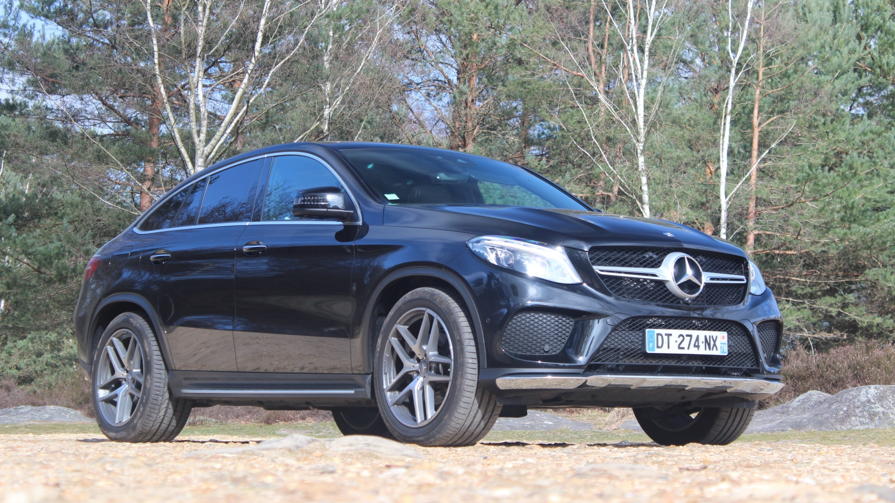
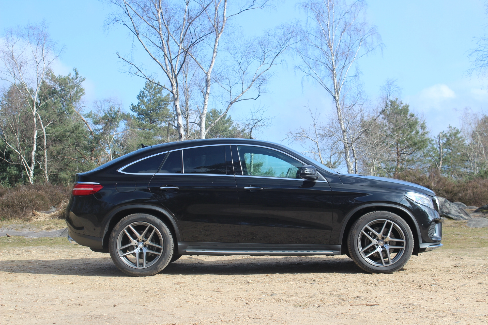

<!-- .slide: data-background="#ffffff" -->



---

Caradisiac

---

Confortable SUV with a large car boot

---

Help me with a API

---

Find list of SUV with the higher rate and the higher volume (car boot)

---

```
Node.js + ES6 + Elasticsearch
```

---

Steps

---

## 92bondstreet/caradisiac

---

Populate

---

Elasticsearch

---

1. use the package [car-api] to get all records in json format
2. index - with bulk - all records to Elasticsearch
3. ...

---

List of SUV

---

1. query to fetch the right data with ES
2. ...

---

MVP of API

---

1. listen port `9292`
1. `/populate`
1. `/suv`

---

Client-side (bonus)

---

Display the list of the cars with React

---

Just tell me what to do

---

* Fork the project via `github`

---

* Clone the project

---

* Don't forget to commit/push before the end of the workshop AND the sessions end

---

<!-- .slide: data-background="#ffffff" -->


